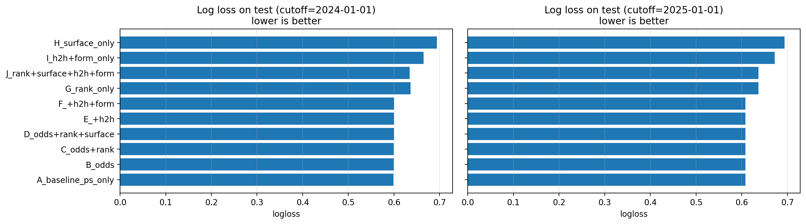
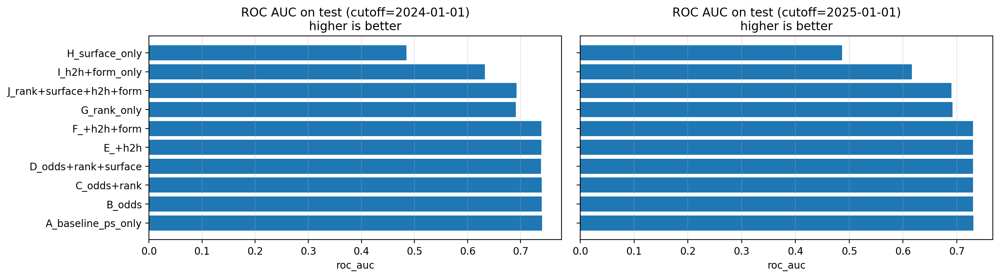
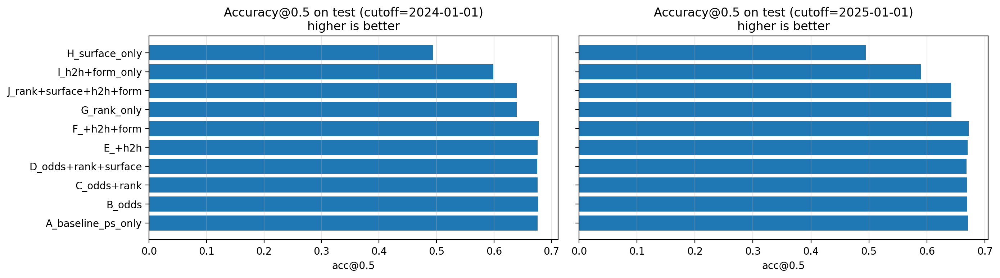
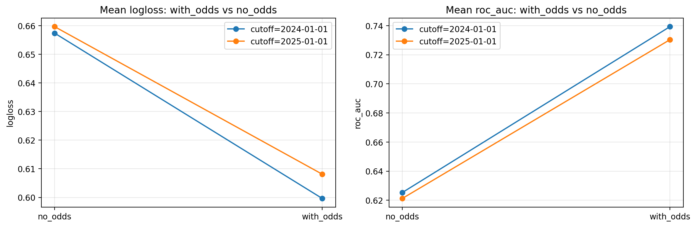
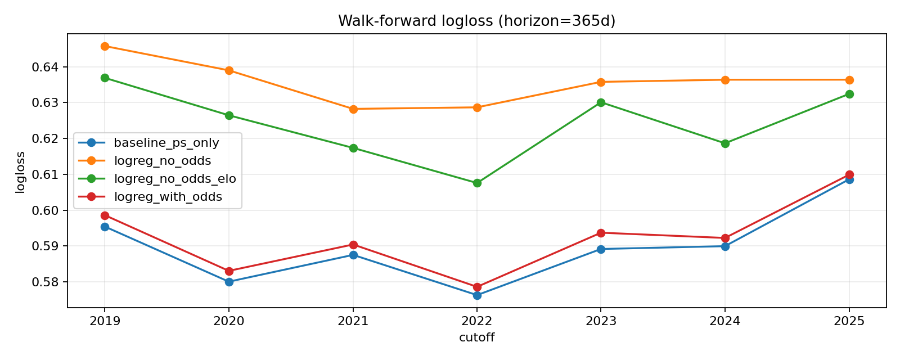
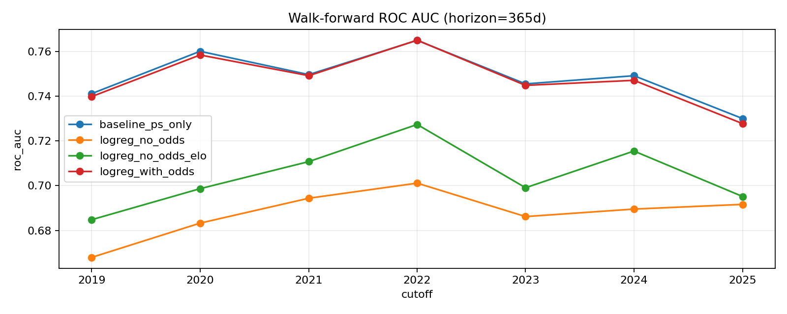
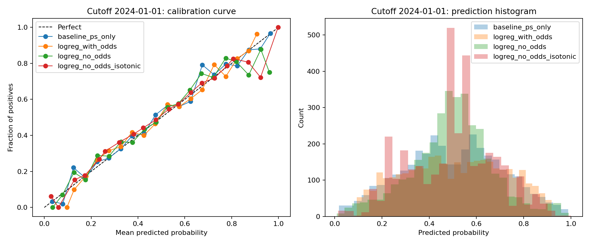
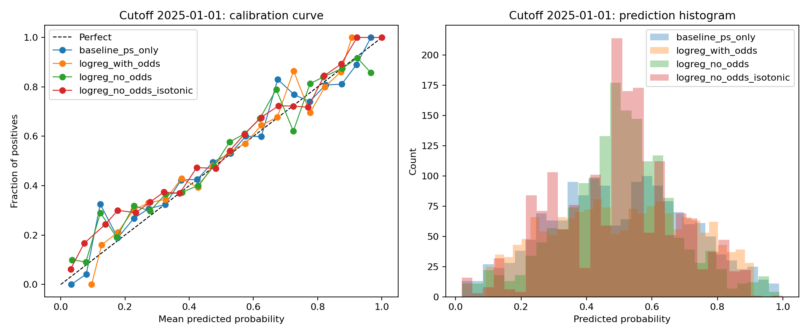

# Глава: Методология, эксперименты и результаты

**Тема магистерской курсовой:** *«Интерпретация Байесовского классификатора на примере данных о результатах спортивных матчей»*  
**Домен:** результаты теннисных матчей ATP  
**Цель главы:** описать методологию построения модели (байесовский подход), протокол экспериментов, интерпретацию признаков и зафиксировать результаты.

---

## 4. Методология

### 4.1. Построение модели

#### 4.1.1. Постановка вероятностной задачи
Рассматривается бинарная классификация исхода матча:

- **`y = 1`** — победил игрок `p1`
- **`y = 0`** — победил игрок `p2`

Модель оценивает вероятность **`P(y=1 | X)`**, где `X` — признаки, доступные до матча.

#### 4.1.2. Бейзлайн «букмекер как модель»
В качестве сильного бейзлайна используется прогноз равный implied probability из Pinnacle:

- **`A_baseline_ps_only`**: `p_pred = ps_imp_p1`.

Этот бейзлайн интерпретируется как внешняя агрегированная оценка вероятности исхода.

#### 4.1.3. Naive Bayes baseline (концепция и применение)
В рамках байесовского подхода базовой моделью рассматривается **Naive Bayes**, где (в упрощении) предполагается условная независимость признаков при фиксированном классе:

`P(y | X) ∝ P(y) · Π_i P(x_i | y)`.

На практике часть признаков является непрерывной, поэтому естественный baseline — **Gaussian Naive Bayes**:

- для каждого класса оцениваются параметры нормальных распределений `x_i | y`;
- апостериорные вероятности `P(y=1|X)` вычисляются по формуле Байеса.

На текущем этапе исследования Naive Bayes рассматривается как **объясняющая модель и класс подходов** (ключевой интерес — интерпретация и сравнение с букмекером), а сравнение наборов признаков реализовано через простую линейную модель (логистическую регрессию) как контроль.

#### 4.1.4. Байесовский классификатор с непрерывными признаками (Gaussian NB)
План применения Gaussian NB в данной задаче:

- входные признаки: числовые (`odds`, `rank`, `h2h`, `form`) и закодированное покрытие (`surface`);
- модель выдаёт апостериорные вероятности `P(y=1|X)`;
- интерпретация проводится через вклад лог-правдоподобий `log P(x_i|y)` и априора `log P(y)`.

#### 4.1.5. Возможное расширение: Bayesian Logistic Regression
В качестве расширения байесовского подхода может рассматриваться **байесовская логистическая регрессия**:

- коэффициенты `β` имеют априорное распределение (например, нормальное);
- обучаемся на данных и получаем постериор `P(β|D)`;
- интерпретация возможна через распределения коэффициентов и неопределённость.

На данном этапе это обозначается как направление расширения, без реализации.

---

### 4.2. Интерпретация (ключевой раздел)

Интерпретация строится вокруг вопроса:

- **какие признаки действительно содержат новую информацию об исходе**, и
- **где и почему модель расходится с оценкой букмекера**.

#### 4.2.1. Группы признаков
Признаки построены блоками для абляционного анализа:

- **Odds / implied probabilities**: `ps_imp_p1`, `b365_imp_p1`.
- **Рейтинг**: `rank_diff_p1_minus_p2`, `rank_points_diff_p1_minus_p2`.
- **Покрытие**: `surface`.
- **Head-to-head**: `h2h_p1_minus_p2_before`.
- **Форма**: `form_diff_p1_minus_p2_last10`.

#### 4.2.2. Абляционный анализ как интерпретационный инструмент
Чтобы оценить вклад группы признаков, сравниваются модели с последовательным добавлением блоков:

- `B_odds`
- `C_odds+rank`
- `D_odds+rank+surface`
- `E_+h2h`
- `F_+h2h+form`

а также контрольные модели **без odds**:

- `G_rank_only`
- `H_surface_only`
- `I_h2h+form_only`
- `J_rank+surface+h2h+form`

Интерпретация: если добавление блока признаков почти не изменяет logloss/AUC, это означает, что данный блок содержит мало «новой» информации **условно на уже имеющихся признаках**.

#### 4.2.3. Сравнение «что думает модель» vs «что думает букмекер»
Букмекер (implied prob) рассматривается как сильная агрегированная оценка, и анализ строится вокруг:

- сравнения распределений `p_model` vs `p_book`;
- поиска матчей с большим расхождением вероятностей;
- анализа, какие признаки приводят к расхождениям (rank, surface, h2h, form).

#### 4.2.4. Калибровка вероятностей
Для вероятностных моделей важна калибровка:

- calibration curve;
- сравнение «кто лучше откалиброван: букмекер или модель»;
- (план) Brier score и/или ECE.

На текущем этапе построены графики сравнения метрик по моделям; калибровка обозначена как следующий шаг.

---

### 4.3. Оценка качества

Используются метрики:

- **Accuracy@0.5**
- **ROC AUC**
- **Log loss** (ключевая метрика качества вероятностей)

Сравнение проводится:

- с бейзлайном букмекера `A_baseline_ps_only`;
- между моделями ablation;
- отдельно анализируются модели **без odds** как «чисто спортивное» прогнозирование.

---

## 5. Эксперименты и результаты

### 5.1. Протокол экспериментов

#### 5.1.1. Разбиение по времени
Использовано разбиение train/test по времени (без утечек):

- **cutoff = 2024-01-01**
- **cutoff = 2025-01-01**

#### 5.1.2. Модель для ablation на текущем этапе
Для быстрого сравнения наборов признаков использовалась **логистическая регрессия** (как интерпретируемая линейная модель).

Отдельно фиксируется, что в курсовой основной интерес — байесовский классификатор; Naive Bayes (в т.ч. Gaussian NB) планируется добавить как отдельную модель с интерпретацией по лог-правдоподобиям.

---

### 5.2. Численные результаты

#### 5.2.1. Cutoff = 2024-01-01 (test n≈3532)

**Odds-блок (лучшие значения):**

- `A_baseline_ps_only`: `logloss=0.598817`, `roc_auc=0.740047`, `acc@0.5=0.675762`
- `B_odds`: `logloss=0.599467`, `roc_auc=0.739640`, `acc@0.5=0.676954`
- `C_odds+rank`: `logloss=0.599468`, `roc_auc=0.739656`, `acc@0.5=0.676104`
- `F_+h2h+form`: `logloss=0.599859`, `roc_auc=0.738935`, `acc@0.5=0.677803`

**No-odds (контрольные модели):**

- `J_rank+surface+h2h+form`: `logloss=0.634122`, `roc_auc=0.692077`, `acc@0.5=0.639298`
- `G_rank_only`: `logloss=0.636440`, `roc_auc=0.691162`, `acc@0.5=0.639581`
- `I_h2h+form_only`: `logloss=0.665166`, `roc_auc=0.632949`, `acc@0.5=0.598811`
- `H_surface_only`: `logloss=0.693789`, `roc_auc=0.485056`, `acc@0.5=0.493488`

#### 5.2.2. Cutoff = 2025-01-01 (test n≈1701)

Ситуация сохраняется:

- odds-модели: `logloss ≈ 0.608`, `roc_auc ≈ 0.730`
- no-odds модели: `logloss ≈ 0.636`, `roc_auc ≈ 0.690`

---

### 5.3. Результаты по графикам (отчётная часть)

В ноутбуке построены графики сравнения моделей по метрикам и по разбиениям:

- **График 1.** Горизонтальные bar-chart для `logloss` по моделям, отдельно для каждого cutoff.
- **График 2.** Аналогично для `ROC AUC`.
- **График 3.** Аналогично для `accuracy@0.5`.
- **График 4.** Сжатое сравнение **`with_odds` vs `no_odds`** (средний `logloss` и средний `AUC`) по cutoff.

Ссылки/места для вставки рисунков (экспорт из ноутбука в PNG):

- `figures/metrics_logloss_by_model.png`
- `figures/metrics_auc_by_model.png`
- `figures/metrics_acc_by_model.png`
- `figures/with_odds_vs_no_odds.png`

Вставка рисунков:

---

## 6. Заключение (по текущему этапу)

### 6.1. Выводы об интерпретируемости

1) **Odds доминируют по качеству** и объясняют основную часть вариативности исходов.

2) Добавление блоков `rank/surface/h2h/form` **почти не улучшает** качество поверх odds.
На cutoff=2024 разница `B_odds` vs `C_odds+rank` по logloss находится на уровне `~1e-6`.

3) **Чисто спортивные признаки содержат сигнал**, но значительно слабее букмекера:

- rank-only: `AUC≈0.69`
- h2h+form: `AUC≈0.62–0.63`
- surface-only: `AUC≈0.48–0.49` (практически случайно)

4) Это согласуется с интерпретацией, что **букмекерская вероятность является агрегатором** множества факторов, и при наличии odds многие спортивные признаки становятся условно избыточными.

### 6.2. Ограничения Naive Bayes в данной задаче

Naive Bayes опирается на сильное предположение об условной независимости признаков при фиксированном классе. В контексте данной задачи:

- odds коррелируют с rank/form и частично «содержат» те же зависимости;
- при добавлении одновременно odds и спортивных фич условная независимость нарушается, и интерпретация вкладов требует аккуратности.

Тем не менее, Naive Bayes остаётся полезным как интерпретируемый базовый байесовский классификатор и как метод анализа того, как отдельные признаки меняют апостериорные вероятности.

### 6.3. Направления улучшения

- **Bootstrap**: доверительные интервалы для `Δlogloss`, `ΔAUC` между моделями (оценка значимости).
- **Walk-forward**: несколько cutoffs для устойчивости вывода «odds доминируют».
- **Калибровка**: calibration curve и Brier score.
- **ELO** (общий и по покрытию) как спортивная фича без букмекера.
- **Gaussian NB / Bayesian Logistic Regression** как байесовские модели с акцентом на интерпретацию.

Также была проведена **walk-forward валидация** (см. ноутбук `walk_forward_validation.ipynb`): использованы годовые cutoffs `2019-01-01, 2020-01-01, …, 2025-01-01` и фиксированный горизонт теста `365` дней. В каждом разбиении сравнивались:

- baseline букмекера `ps_imp_p1`;
- Logistic Regression `with_odds` (odds + surface);
- Logistic Regression `no_odds` (rank/rank_points + surface).

Наблюдение устойчиво по всем cutoffs: **baseline букмекера остаётся лучшим или практически неотличимым от `with_odds`**, в то время как `no_odds` заметно уступает. Типичные значения по разбиениям:

- baseline: `logloss ≈ 0.576–0.609`, `ROC AUC ≈ 0.730–0.765`;
- `with_odds`: метрики очень близки к baseline (иногда чуть хуже по logloss/AUC);
- `no_odds`: `logloss ≈ 0.628–0.646`, `ROC AUC ≈ 0.668–0.702`.

Дополнительно была проверена модификация без odds с добавлением рейтингов **ELO** (общий рейтинг игрока и рейтинг по покрытию), рассчитанных онлайн «до матча». Результат устойчив по всем cutoffs: **`no_odds_elo` улучшает `no_odds`**, но всё ещё заметно уступает моделям с odds.

- `no_odds_elo`: `logloss ≈ 0.608–0.636`, `ROC AUC ≈ 0.685–0.727`;
- средняя дельта к `no_odds` (по 7 cutoffs): `Δlogloss ≈ -0.0127`, `ΔAUC ≈ +0.0198`.

Дополнительно были посчитаны **bootstrap 95% CI** для разниц метрик на тестовых матчах (ресэмплинг матчей с возвращением, `B=5000`). Для интерпретации знака использованы:

- `Δlogloss = logloss(model_b) - logloss(model_a)` (logloss меньше — лучше, поэтому **отрицательная** дельта означает улучшение `model_b`);
- `ΔAUC = AUC(model_b) - AUC(model_a)` (AUC больше — лучше, поэтому **положительная** дельта означает улучшение `model_b`).

Результаты по cutoffs:

- `baseline_ps_only` vs `logreg_with_odds`: на всех cutoffs `2019–2025` 95% CI по `Δlogloss` полностью **> 0** и 95% CI по `ΔAUC` полностью **< 0**, т.е. `with_odds` статистически значимо уступает baseline букмекера.
- `logreg_no_odds` vs `logreg_no_odds_elo`: на cutoffs `2019–2022` и `2024` 95% CI по `Δlogloss` полностью **< 0** и по `ΔAUC` полностью **> 0** (добавление ELO даёт статистически значимое улучшение). На cutoffs `2023` и `2025` CI пересекает 0 (эффект слабее/менее стабилен).

Графики walk-forward:

Результаты первичной проверки калибровки вероятностей (см. ноутбук `calibration_analysis.ipynb`) показали, что baseline по implied probability (`ps_imp_p1`) остаётся лучшим не только по logloss/AUC, но и по Brier score. Logistic Regression с odds в среднем близок по качеству, но немного уступает baseline. Для моделей без odds была проверена пост-калибровка изотонической регрессией (isotonic): на cutoff `2024-01-01` она дала небольшое улучшение logloss/Brier, однако на cutoff `2025-01-01` улучшения не наблюдалось.

Графики калибровки (reliability diagrams):

Дополнительно на текущем этапе был проверен блок погодных признаков (Open-Meteo Archive API + SQLite-кэш запросов): дневные `tmax/tmin`, осадки и максимальная скорость ветра по связке (`Location`, дата матча) для матчей `Outdoor`. При покрытии порядка ~80% строк (остальное — `NaN` из-за отсутствия `Location`/ошибок геокодинга) добавление погоды **не улучшило** качество на cutoffs `2024-01-01` и `2025-01-01`: для no-odds моделей наблюдалось небольшое ухудшение logloss/AUC. Возможные причины: грубая привязка «город → координаты» вместо конкретного корта/стадиона, использование дневных агрегатов вместо почасовых условий в момент матча и размывание эффекта из-за наличия indoor-матчей.

Перспективные направления улучшения погодного блока:

- учитывать погоду **только на подвыборке outdoor** (и/или включать `Court` как отдельный фактор);
- перейти к более точной геолокации (стадион/координаты турнира) и/или нормализовать `Location`;
- использовать **почасовые** значения (температура/ветер/влажность) ближе к времени начала матча.

---

## 7. Анализ по типам покрытия (surface stratification)

Для проверки устойчивости выводов был проведён отдельный анализ по типам покрытия корта (hard, clay, grass). Использовано разбиение train/test по cutoff `2024-01-01`.

### 7.1. Мультиколлинеарность признаков

Для набора признаков `ps_imp_p1`, `rank_diff_p1_minus_p2`, `rank_points_diff_p1_minus_p2` был рассчитан **VIF (Variance Inflation Factor)**:

| feature | VIF |
|---------|-----|
| const | 13.99 |
| ps_imp_p1 | 2.37 |
| rank_diff_p1_minus_p2 | 1.37 |
| rank_points_diff_p1_minus_p2 | 2.03 |

Все VIF < 10 — мультиколлинеарность отсутствует. Корреляция между `ps_imp_p1` и `rank_points_diff` (0.71) умеренная, не критичная.

### 7.2. Корреляционная матрица

| | ps_imp_p1 | rank_diff | rank_points_diff | y_p1_win |
|--|-----------|-----------|------------------|----------|
| ps_imp_p1 | 1.000 | -0.519 | 0.712 | 0.43 |
| rank_diff | -0.519 | 1.000 | -0.385 | -0.22 |
| rank_points_diff | 0.712 | -0.385 | 1.000 | 0.30 |
| y_p1_win | 0.430 | -0.220 | 0.300 | 1.00 |

`ps_imp_p1` имеет наибольшую корреляцию с целевой переменной (0.43), что подтверждает информативность букмекерских odds.

### 7.3. Сравнение LR vs Baseline по покрытиям

На тестовой выборке (2024+) сравнивались логистическая регрессия (LR) и baseline (Pinnacle implied probability):

| surface | n | LR logloss | LR AUC | LR acc | PS logloss | PS AUC | PS acc |
|---------|---|------------|--------|--------|------------|--------|--------|
| hard | 1866 | 0.5990 | 0.7402 | 0.6736 | 0.5989 | 0.7401 | 0.6693 |
| clay | 1145 | 0.6123 | 0.7208 | 0.6629 | 0.6121 | 0.7209 | 0.6611 |
| grass | 524 | 0.5854 | 0.7532 | 0.6908 | 0.5841 | 0.7531 | 0.6947 |

**Разница LR vs PS (Δacc):**
- hard: +0.43%
- clay: +0.17%
- grass: -0.39%

### 7.4. Распределение матчей по покрытиям

| surface | count |
|---------|-------|
| hard | 10106 |
| clay | 5417 |
| grass | 2110 |

### 7.5. Выводы

1. **LR практически не улучшает предсказание** по сравнению с baseline букмекера на всех покрытиях.
2. Наибольшая точность достигается на **grass** (69.1% LR, 69.5% PS), наименьшая — на **clay** (~66%).
3. Это согласуется с основным выводом: букмекерские odds уже агрегируют информацию о рейтинге и других факторах, и добавление спортивных признаков поверх odds даёт минимальный прирост.
